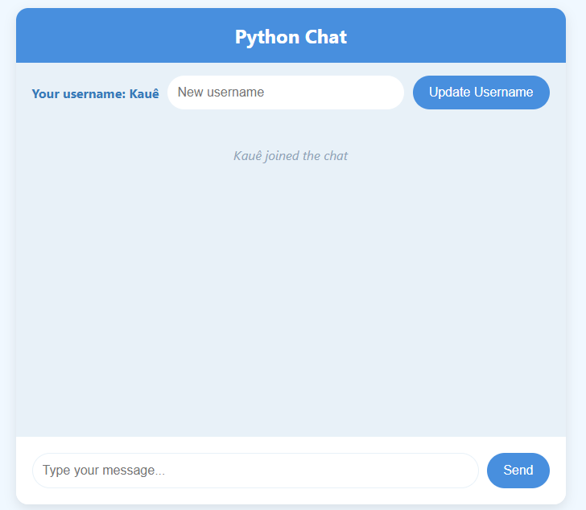

<h1 align="center">Aplicativo de chat</h1>

<p align="center">

</p>

> [!NOTE]
> *Esse projeto pode ter alterações no futuro.*

### Tópicos

- [Descrição do projeto](#descrição-do-projeto)
  - [Funcionalidades Principais](#funcionalidades-principais)
- [Tecnologias](#tecnologias)
- [Projeto em funcionamento](#projeto-em-funcionamento)
- [Como utilizar o projeto](#como-utilizar-o-projeto)
- [Colaboradores](#colaboradores)

## Descrição do projeto

Este projeto é um aplicativo de chat desenvolvido para conectar o front-end e o back-end, permitindo uma comunicação em tempo real e uma experiência interativa para o usuário.

### Funcionalidades Principais
> ***Alteração de Nome de Usuário:*** Permite ao usuário mudar seu apelido durante a conversa. <br>
> ***Envio e Recebimento de Mensagens:*** Os usuários podem trocar mensagens instantaneamente. <br>
> ***Notificações de Status:*** Exibe notificações quando um usuário entra, sai ou muda de nome na conversa.

Este chat app oferece uma interface simples e funcional, facilitando a comunicação e mantendo os usuários informados sobre as atividades na conversa.

## Tecnologias

<div width="140px">
    
</div>

## Projeto em funcionamento

Clique na imagem abaixo para assistir ao tutorial em vídeo!

[](semvideo.com)

**Descrição**: Este vídeo cobre todo o processo para visualizar o projeto em funcionamento, do início ao fim.

## Como utilizar o projeto

```
< INSTALADORES >

pip install
python -m venv venv
pip install flask flask_socketio


< INICIADORES >

Ativar: .\venv\Scripts\activate
Desativar: deactivate
python ./app.py

```

> **1**: Abra o projeto no VsCode.<br>
> **2**: Instale o python com `pip install`. Se já possuir, desconsidere esse passo.<br>
> **3**: Instale o `python -m venv venv`.<br>
> **4**: Rode no terminal o comando `.\venv\Scripts\activate`.<br>
> **5**: Instale o `pip install flask flask_socketio`.<br>
> **6**: Inicie o servidor digitando o comando `python ./app.py` no terminal da IDE.

## Colaboradores

| [<br><sub>Kauê Bertaze de Oliveira</sub>](https://github.com/KaueTTS)<br><sub>Developer Full Stack</sub> |
| :---:
